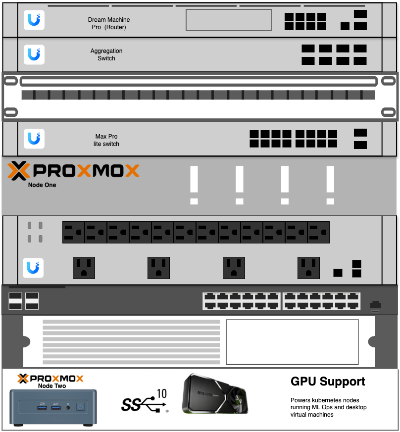

# Built At Home

  
  
<em>by Dillan Teagle</em>

    
    
    
    

---

## A platform for

- ⚙️ **Automation**

    ---

    Workflow automation support with n8n for seamless integrations and task orchestration.

    [→ Learn more](platform/workflows.md)

- 🔒 **Privacy**

    ---

    Focus on network privacy, security, and lab sandboxes for safe experimentation.

    [→ Network setup](network.md)

- 🧠 **Research**

    ---

    AI powered research with self-hosted LLMs, agents, and research tools.

    [→ AI Platform](platform/ai.md)

---

## Quick Links

| Section | Description |
|---------|-------------|
| [Overview](overview.md) | High-level architecture diagram |
| [Hardware](hardware.md) | Detailed hardware inventory |
| [Kubernetes](infra/kubernetes.md) | Talos Linux cluster setup |
| [AI Platform](platform/ai.md) | AI gateway and providers |
| [Observability](platform/observability.md) | GPU metrics and monitoring |

---

## Getting Started

This documentation covers the complete setup and configuration of my homelab infrastructure, including:

- **Proxmox virtualization** with GPU passthrough
- **Talos Linux Kubernetes clusters** with Cilium networking
- **Multi-cluster architecture** using ClusterMesh
- **AI/ML platform** with multiple LLM providers
- **GitOps workflows** with Argo CD
