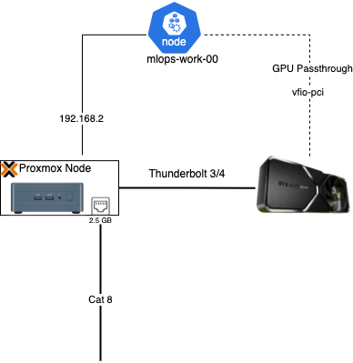

# Kubernetes

[Talos Linux](https://www.talos.dev/v1.9/) is a Linux operating system that runs and manages Kubernetes.

## Core

### Networking

* **CNI**
    - [Cilium](https://docs.cilium.io/en/stable/index.html)
        - [ClusterMesh](https://cilium.io/use-cases/cluster-mesh/) - used for establishing inter-cluster networking between `administration` and `mlops`.

* **DNS**
    - [CoreDNS](https://coredns.io/manual/toc/) - Originally custom CoreDNS configurations were required when running ClusterMesh. Need to consider if this is still necessary now that Cilium created the `mcsapi` which handles resolving DNS for services when ClusterMesh is enabled.
    - [ExternalDNS](https://github.com/kubernetes-sigs/external-dns)
    - [ExternalDNS Unifi Webhook](https://github.com/kashalls/external-dns-unifi-webhook)

* **Certificate Management**
    - [CertManager](https://github.com/cert-manager/cert-manager)

### Layer 4 Proxy

- [Gateway API](https://gateway-api.sigs.k8s.io/)
    - [Inference Extension](https://gateway-api-inference-extension.sigs.k8s.io/)
- [Kgateway](https://kgateway.dev/docs/main) - AI Gateway for all traffic in `ai` namespace. View docs in [Platform AI](../platform/ai.md) for further information on all AI related resources.

### Gateways

Cilium and Kgateway both utilize GatewayAPI for creating gateway & route declarations. For that reason, we have several different base `GatewayClasses`. All AI traffic should use `GatewayClass` with a target from Kgateway and non-AI workloads will use Cilium.

| Gateway | Purpose |
|---------|---------|
| Internal Gateway | All standard ingress traffic |
| Egress Gateway | All standard egress traffic |
| External Gateway | Cloudflare tunnel for OAuth callbacks from external providers |
| AI Gateway | All AI traffic in `ai` namespace (HTTP/TCP) |
| VPN Gateway | Site-to-site VPN traffic from homelab to AWS VPC |

#### VPN Gateway

Routes exchanged:

- **From Homelab → AWS**: Pod CIDRs (per cluster), Service LB CIDR, on-prem subnets
- **From AWS → Homelab**: VPC CIDRs, AWS service subnets

```text
      Homelab (Unifi / Proxmox)                      AWS VPC (10.XX.0.0/16)
                |                                               |
         Talos Cluster(s)
           VPN Gateway                                EC2 (FRR+WG)
            Cilium                                         wg0 + BGP
                |                                               |
        +-------+----------------+                      +--------+------+
        | WireGuard tunnel (wg0) |======================| WireGuard wg0 |
        +------------------------+                      +---------------+
                 |   BGP (64512 <-> 64513) over WireGuard   |
                 |-------------------------------------------|
```

### Inter-Cluster Networking

Using [MCS API](https://docs.cilium.io/en/latest/network/clustermesh/mcsapi/):

```text
                       Internet
                           |
                 +---------+---------+
                 |                   |
        Cloudflare (Public DNS)   Unifi (Internal DNS)
                 |                   |
                 +---------+---------+
                           |
                  Unifi Gateway / Edge
                           |
                   LAN XXX.XX.X.0/24
                           |
         +-----------------+-----------------+
         |                                   |
   Proxmox Host(s)                       Proxmox Host(s)
         |                                   |
   Talos Cluster: mlops               Talos Cluster: administration
   (AI workloads)                     (platform/ops)
         |                                   |
   +-----+-------------------+         +-----+-------------------+
   | Cilium (BGP, LB/IPAM)   |         | Cilium (BGP, LB/IPAM)   |
   | ClusterMesh (peer)      |<------->| ClusterMesh (peer)      |
   +-----------+-------------+         +-----------+-------------+
               |                                   |
     Gateway API / KGateway                Gateway API
     ai-gateway (TLS)                      admin-gateway (TLS)
               |                                   |
        HTTPRoutes (/ollama, ...)          HTTPRoutes (admin apps)
               |                                   |
        Services / Backends                Services (Argocd, Observability, etc.)
```

## Security

* **Certificates** - CertManager is used to automate certificate management and rotation for all services, both internal and external routes.
    - `internal` certificates use internal DNS resolution with [ExternalDNS webhook](https://github.com/kashalls/external-dns-unifi-webhook). A cluster issuer exists for issuing all internal certificates.
    - `external` certificates are managed with Cloudflare and an issuer exists using Cloudflare for issuing these certificates. These services are only exposed over Cloudflare tunnels.

## Clusters

Cilium ClusterMesh is used for multi-cluster networking. The `administration cluster` is responsible for GitOps operations and cluster management using ApplicationSets in Argo CD.

### Administration Cluster

| Node | Role |
|------|------|
| `admin-ctrl-00` | Control Plane |
| `admin-work-00` | Worker |
| `admin-work-01` | Worker |

### MLOps Cluster

| Node | Role |
|------|------|
| `mlops-ctrl-00` | Control Plane |
| `mlops-work-00` | Worker |
| `mlops-work-01` | Worker (GPU) |

## GPU Passthrough

**vfio-pci** is set as the kernel driver on the GeForce RTX 4070 Super. This is needed for GPU passthrough to work so the virtualized Kubernetes node can utilize it. It is registered in Proxmox as a PCIe device which is defined in Terraform [here](https://github.com/teaglebuilt/homelab/blob/main/tf_modules/talos_cluster/pci_mapping.tf).


