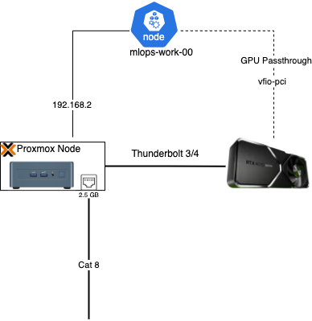

# Kubernetes

[Talos Linux](https://www.talos.dev/v1.9/) is a Linux operating system that runs and manages Kubernetes.


## Core

### Networking

* **CNI**
    - [Cilium](https://docs.cilium.io/en/stable/index.html)
        - [ClusterMesh](https://cilium.io/use-cases/cluster-mesh/) - used for establishing inter-cluster networking between `application` and `mlops`.

* **DNS**
    - [CoreDNS](https://coredns.io/manual/toc/) - Originally custom CoreDNS configurations were required when running ClusterMesh. Need to consider if this is still necessary now that Cilium created the `mcsapi` which handles resolving DNS for services when ClusterMesh is enabled.
    - [ExternalDNS](https://github.com/kubernetes-sigs/external-dns)
    - [ExternalDNS Unifi Webhook](https://github.com/kashalls/external-dns-unifi-webhook)

* **Certificate Management**
    - [CertManager](https://github.com/cert-manager/cert-manager)

### Layer 4 Proxy

- [Gateway API](https://gateway-api.sigs.k8s.io/)
    - [Inference Extension](https://gateway-api-inference-extension.sigs.k8s.io/)
- [Kgateway](https://kgateway.dev/docs/main) - AI Gateway for all traffic in `ai` namespace. View docs in [Platform AI](../platform/ai.md) for further information on all AI related resources.

### Gateways

Cilium and Kgateway both utilize GatewayAPI for creating gateway & route declarations. For that reason, we have several different base `GatewayClasses`. All AI traffic should use `GatewayClass` with a target from Kgateway and non-AI workloads will use Cilium.

| Gateway | Purpose |
|---------|---------|
| Internal Gateway | All standard ingress traffic |
| Egress Gateway | All standard egress traffic |
| External Gateway | Cloudflare tunnel for OAuth callbacks from external providers |
| AI Gateway | All AI traffic in `ai` namespace (HTTP/TCP) |
| VPN Gateway | Site-to-site VPN traffic from homelab to AWS VPC |

#### VPN Gateway

Routes exchanged:

- **From Homelab → AWS**: Pod CIDRs (per cluster), Service LB CIDR, on-prem subnets
- **From AWS → Homelab**: VPC CIDRs, AWS service subnets

```text
      Homelab (Unifi / Proxmox)                      AWS VPC (10.XX.0.0/16)
                |                                               |
         Talos Cluster(s)
           VPN Gateway                                EC2 (FRR+WG)
            Cilium                                         wg0 + BGP
                |                                               |
        +-------+----------------+                      +--------+------+
        | WireGuard tunnel (wg0) |======================| WireGuard wg0 |
        +------------------------+                      +---------------+
                 |   BGP (64512 <-> 64513) over WireGuard   |
                 |-------------------------------------------|
```

```text
                       Internet
                           |
                 +---------+---------+
                 |                   |
        Cloudflare (Public DNS)   Unifi (Internal DNS)
                 |                   |
                 +---------+---------+
                           |
                  Unifi Gateway / Edge
                           |
                   LAN XXX.XX.X.0/24
                           |
         +-----------------+-----------------+
         |                                   |
   Proxmox Host(s)                       Proxmox Host(s)
         |                                   |
   Talos Cluster: mlops               Talos Cluster: application
   (AI workloads)                     (platform/ops)
         |                                   |
   +-----+-------------------+         +-----+-------------------+
   | Cilium (BGP, LB/IPAM)   |         | Cilium (BGP, LB/IPAM)   |
   | ClusterMesh (peer)      |<------->| ClusterMesh (peer)      |
   +-----------+-------------+         +-----------+-------------+
               |                                   |
     Gateway API / KGateway                Gateway API
     ai-gateway (TLS)                      admin-gateway (TLS)
               |                                   |
        HTTPRoutes (/ollama, ...)          HTTPRoutes (admin apps)
               |                                   |
        Services / Backends                Services (Argocd, Observability, etc.)
```

## Security

* **Certificates** - CertManager is used to automate certificate management and rotation for all services, both internal and external routes.
    - `internal` certificates use internal DNS resolution with [ExternalDNS webhook](https://github.com/kashalls/external-dns-unifi-webhook). A cluster issuer exists for issuing all internal certificates.
    - `external` certificates are managed with Cloudflare and an issuer exists using Cloudflare for issuing these certificates. These services are only exposed over Cloudflare tunnels.
    - `shared` A shared certificate is provisioned between clusters for joining the the clustermesh in `kubernetes/clusteres/shared/cilium-ca.sops.yaml`

## Clusters

Cilium ClusterMesh is used for multi-cluster networking. The `application cluster` is responsible for GitOps operations and cluster management using ApplicationSets in Argo CD.

### Admin Cluster

Gitops administration and declaration for cluster fleet management and control.

| Node | Role |
|------|------|
| `admin-ctrl-00` | Control Plane |
| `admin-work-00` | Worker |

### Application Cluster

General application related workloads and services

| Node | Role |
|------|------|
| `app-ctrl-00` | Control Plane |
| `app-work-00` | Worker |
| `app-work-01` | Worker |

### MLOps Cluster

Generative AI and Machine Learning Operations

| Node | Role |
|------|------|
| `mlops-ctrl-00` | Control Plane |
| `mlops-work-00` | Worker |
| `mlops-work-01` | Worker (GPU) |

#### GPU Passthrough

**vfio-pci** is set as the kernel driver on the GeForce RTX 4070 Super. This is needed for GPU passthrough to work so the virtualized Kubernetes node can utilize it. It is registered in Proxmox as a PCIe device which is defined in Terraform [here](https://github.com/teaglebuilt/homelab/blob/main/tf_modules/talos_cluster/pci_mapping.tf).



## Bootstrapping

Helmfile bootstraps every cluster. The layout separates *what a cluster is* from *what gets
installed*: each cluster owns a directory under `kubernetes/clusters/<cluster>/` describing its
identity and feature toggles, while `kubernetes/helmfile.d/` holds numbered stages shared by all
clusters. A cluster's `helmfile.yaml` stitches the two together by including each stage and passing
its own `cluster` name down.

### Per-cluster files

| File | Purpose |
|------|---------|
| `cluster.yaml` | Immutable identity: `clusterId`, pod/service subnets, DNS IP, Proxmox host, LB pool, ClusterMesh apiserver IP |
| `environment.yaml` | Feature toggles under `enable:`, plus node pinning and LoadBalancer IP overrides |
| `helmfile.yaml` | Normal entrypoint — includes stages 00 through 05 |
| `mesh.yaml` | Targeted entrypoint including stage 01 only, used by `mesh-upgrade` for a fast Cilium-only upgrade |
| `identity-values.yaml.gotmpl` | Cilium cluster name/ID and native-routing CIDR |
| `clustermesh-values.yaml.gotmpl` | ClusterMesh apiserver, TLS SANs, and declarative peering to the other cluster |

Pod CIDRs must never overlap between clusters (`mlops` uses `10.244.0.0/16`, `application` uses
`10.245.0.0/16`) and `clusterId` must be unique — both are hard ClusterMesh requirements.

### Stages

Stages run in order. Dependencies within a stage use Helmfile `needs:`.

| Stage | File | Contents |
|-------|------|----------|
| Prepare | `00-prepare` | Hooks only, no releases. Labels the `default` namespace privileged for BPF/hostNetwork workloads, applies local storage, decrypts SOPS secrets (AWS, GHCR, shared Cilium CA), and installs Gateway API v1.2.0, Prometheus Operator, and Inference Extension CRDs |
| Bootstrap Network | `01-bootstrap` | Establish what is needed for networking to work - `reflector`, `reloader`, `cilium`, `coredns`, `spegel`, `csi-driver-nfs`, `metrics-server` |
| Bootstrap Core | `02-core` | Setup all networking depdendencies - `cloudflare-tunnel`, `internal-dns`, `external-dns`, `cert-manager`, `homelab-gateway`, `cnpg` |
| Bootstrap Hardware | `03-hardware` | Deploy resources for hardware support - `nvidia-device-plugin`, `dcgm-exporter`, `node-problem-detector`, `kwasm-operator`, `spin-operator`, `netops-agent` |
| Bootstrap Monitoring |  `04-monitoring` | `vector`, `grafana-operator` — the Prometheus/Grafana stack itself ships via `platform:deploy` |
| Bootstrap Gitops | `05-gitops` | not yet implemented - `argocd` |

Most releases are gated on an `enable.*` toggle, so a stage renders differently per cluster. For
example `frontDoor` is true only on `application`, which is why the Cloudflare tunnel and the public
`external-dns` exist there and nowhere else.

### Deploy flow

`task deploy-kubernetes` runs the whole build end to end:

1. `provision-application` and `provision-mlops` — OpenTofu creates the Talos VMs on Proxmox and
   bootstraps each cluster.
2. `bootstrap-cluster CLUSTER=mlops`, then `CLUSTER=application` — syncs all stages via each
   cluster's `helmfile.yaml`.
3. `connect-clusters` — generates the shared mesh CA if it does not yet exist, runs `mesh-upgrade` on
   both clusters (each of which applies that CA), then reports ClusterMesh status for each.
4. `merge-kubeconfig`, then waits for each cluster's external TLS certificate to go Ready.
5. `platform:deploy` for both clusters, followed by `deploy-cloudflare-tunnel`.

Because ClusterMesh peering is declarative, each cluster's `clustermesh-values.yaml.gotmpl` lists
*the other* cluster's apiserver address. Cilium derives the `cilium-clustermesh` secret from that
plus the shared CA, so a healthy mesh reports `1/1 remote clusters ready` on **both** sides. A
one-sided sync produces a half-connected mesh where only one cluster sees the other.

### Overlay injection

Stage `01-bootstrap` builds the Cilium release from a base values file plus up to two overlays,
passed down from the cluster's entrypoint:

* `identityOverlay` — always applied; sets the cluster name, ID, and routing CIDR.
* `meshOverlay` — applied when `enable.clusterMesh` is true in `environment.yaml`.

The `meshOverlay` gate matters operationally. Both `helmfile.yaml` and `mesh.yaml` pass the overlay
unconditionally and stage 01 enforces the toggle, which keeps `environment.yaml` the single source of
truth. This is what allows routine `sync-cluster` and `bootstrap-cluster` runs to preserve the mesh:
if the overlay were only injected by the `mesh-upgrade` path, any ordinary sync would re-render Cilium
without the ClusterMesh block and Helm would tear the mesh down until `connect-clusters` ran again.

### Shared mesh CA

ClusterMesh uses `tls.authMode: cluster`, which requires both clusters to sign their mesh
certificates from **one** CA. That CA lives SOPS-encrypted at
`kubernetes/clusters/_shared/cilium-ca.sops.yaml` and is applied as a `cilium-ca` Secret in
`kube-system` on both clusters, then stamped with Helm ownership metadata so the Cilium release can
adopt it. Stage `00-prepare` does this during a normal sync and `mesh-upgrade` repeats it
idempotently, since `mesh.yaml` does not include stage 00.

Two consequences worth knowing: the CA must exist *before* Cilium renders with `authMode: cluster`,
or `clustermesh-apiserver` never becomes Ready. And sharing the CA is also what makes cross-cluster
Hubble work — Hubble Relay uses mTLS to reach remote nodes, so a single Hubble UI can observe flows
from both clusters.

### Task reference

| Task | Effect |
|------|--------|
| `task deploy-kubernetes` | Full build: provision, bootstrap both clusters, connect the mesh, deploy platform services |
| `task kubernetes:bootstrap-cluster CLUSTER=<c>` | Syncs all stages for one cluster |
| `task kubernetes:sync-cluster CLUSTER=<c>` | Re-syncs one cluster without the provisioning preconditions |
| `task kubernetes:mesh-upgrade CLUSTER=<c>` | Applies the shared CA and upgrades only the Cilium release |
| `task kubernetes:connect-clusters` | Ensures the shared CA, mesh-upgrades both clusters, reports status |
| `task kubernetes:cilium:clustermesh-status CLUSTER=<c>` | Read-only mesh health for one cluster |
