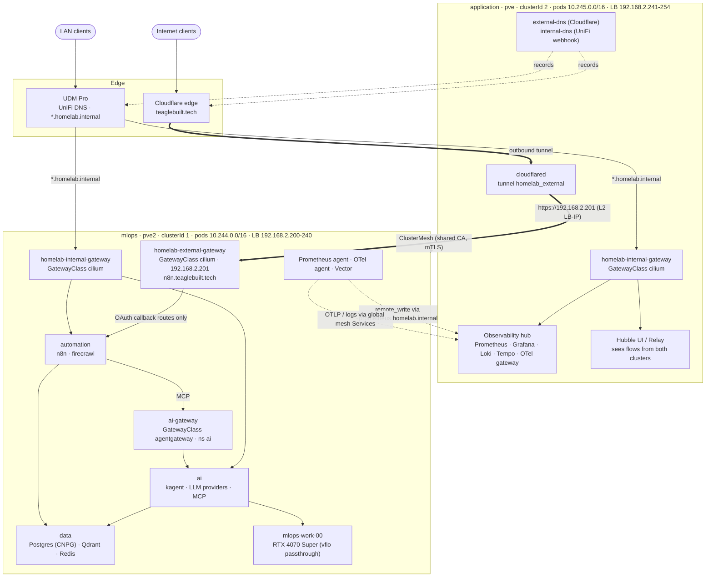
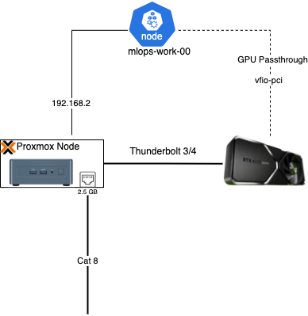

# Kubernetes

[Talos Linux](https://www.talos.dev/v1.9/) is a Linux operating system that runs and manages Kubernetes.

## Architecture

Two Talos clusters on separate Proxmox hosts, joined by Cilium ClusterMesh. `application` is the
front door and the observability hub. `mlops` runs the GPU, AI, automation and data workloads, and
it is the only cluster that serves public traffic.

How to read it:

* **Public path (thick arrows).** Cloudflare reaches the homelab only through the outbound tunnel
  that `cloudflared` holds open from `application`. Tunnel routing is managed remotely in
  `terraform/cloudflare_tunnel.tf` and points `n8n.teaglebuilt.tech` at the pinned LoadBalancer IP of
  `mlops`'s external gateway. That hop runs over the LAN (an L2-announced IP), not over ClusterMesh. The
  external gateway admits routes only from namespaces labelled `homelab.io/public-ingress: "true"`.
* **Internal path.** UniFi resolves `*.homelab.internal` to each cluster's internal gateway, using
  records written by `internal-dns` through the UniFi webhook. Both clusters run an internal gateway,
  and each HTTPRoute attaches to the gateway in its own cluster.
* **AI traffic.** Anything in the `ai` namespace goes through `ai-gateway`, which uses the
  `agentgateway` GatewayClass. The agentgateway controller is installed by
  `platform/ai/kubernetes/kustomization.yaml`. Other workloads use the Cilium GatewayClass.
* **Telemetry (dotted).** `mlops` keeps no long-term telemetry of its own. Its Prometheus runs in
  agent mode and remote-writes to the hub through the internal gateway. OTLP traces and Vector logs
  reach the hub through Cilium global Services (`otel-collector-mesh`, `loki-gateway-mesh`) across
  ClusterMesh.
* **Mesh.** ClusterMesh peering is declarative on both sides and depends on the shared CA (see
  [Shared mesh CA](#shared-mesh-ca)). The shared CA is also what lets the single Hubble UI on
  `application` observe both clusters.

## Core

### Networking

* **CNI**
    - [Cilium](https://docs.cilium.io/en/stable/index.html)
        - [ClusterMesh](https://cilium.io/use-cases/cluster-mesh/) - used for establishing inter-cluster networking between `application` and `mlops`.

* **DNS**
    - [CoreDNS](https://coredns.io/manual/toc/) - Originally custom CoreDNS configurations were required when running ClusterMesh. Need to consider if this is still necessary now that Cilium created the `mcsapi` which handles resolving DNS for services when ClusterMesh is enabled.
    - [ExternalDNS](https://github.com/kubernetes-sigs/external-dns)
    - [ExternalDNS Unifi Webhook](https://github.com/kashalls/external-dns-unifi-webhook)

* **Certificate Management**
    - [CertManager](https://github.com/cert-manager/cert-manager)

### Gateway API

All north-south HTTP routing uses [Gateway API](https://gateway-api.sigs.k8s.io/) v1 resources.
Two GatewayClasses are in use:

* `cilium` — Cilium's built-in Gateway API implementation, used for all non-AI traffic.
* `agentgateway` — the [agentgateway](https://agentgateway.dev/) data plane (kgateway project), used
  for AI and MCP traffic in the `ai` namespace. See [AI Platform](platform/ai/index.md).

The [Inference Extension](https://gateway-api-inference-extension.sigs.k8s.io/) CRDs are installed in
stage `00-prepare`.

### Gateways

| Gateway | Namespace | Class | Cluster | Purpose | Defined in |
|---------|-----------|-------|---------|---------|------------|
| `homelab-internal-gateway` | `kube-system` | `cilium` | both | LAN ingress for `*.homelab.internal` (HTTP 80, HTTPS 443) | `kubernetes/charts/homelab-gateway/templates/internal-gateway.yaml` |
| `homelab-external-gateway` | `kube-system` | `cilium` | `mlops` only (`enable.publicGateway`) | Public origin behind the Cloudflare tunnel; one HTTPS listener per `tunnelHostnames` entry (currently `n8n`). Pinned to `192.168.2.201` | `kubernetes/charts/homelab-gateway/templates/external-gateway.yaml` |
| `ai-gateway` | `ai` | `agentgateway` | `mlops` | AI, MCP and kagent UI traffic | `platform/ai/kubernetes/aigateway/gateway.yaml` |

The external gateway only accepts HTTPRoutes from namespaces labelled
`homelab.io/public-ingress: "true"`. The Cloudflare tunnel and its public DNS record
(`external-dns-endpoint.yaml`) live on `application` (`enable.frontDoor`). The tunnel's routing rules
are managed remotely in `terraform/cloudflare_tunnel.tf`, not in the Helm values.

There is no cluster egress gateway or site-to-site VPN gateway. The only VPN code in the repo is
`tf_modules/algo_vpn`, a Terraform module that provisions an [Algo](https://github.com/trailofbits/algo)
WireGuard server over SSH. No root module currently references it.

## Security

* **Certificates** - CertManager is used to automate certificate management and rotation for all services, both internal and external routes.
    - `internal` — `*.homelab.internal` certificates are issued by `internal-ca-cluster-issuer`, a private CA (`kubernetes/apps/security/cert-manager/internal-ca-issuer.yaml`). Their DNS records are written to UniFi by `internal-dns` through the [ExternalDNS UniFi webhook](https://github.com/kashalls/external-dns-unifi-webhook).
    - `external` — `*.teaglebuilt.tech` certificates are issued by `cloudflare-dns-issuer` using a Cloudflare DNS-01 challenge (`kubernetes/apps/security/cert-manager/cloudflare-issuer.yaml`).
    - `shared` — the ClusterMesh CA shared by both clusters, stored at `kubernetes/clusters/_shared/cilium-ca.sops.yaml` (see [Shared mesh CA](#shared-mesh-ca)).

## Clusters

Two clusters are deployed: `application` and `mlops`, joined by Cilium ClusterMesh. Each is defined in
`kubernetes/clusters/<cluster>/` and its VMs in `kubernetes/terraform/<cluster>/main.tf`. Neither
cluster runs Argo CD today. `enable.gitops` is `false` in both `environment.yaml` files.

### Admin Cluster (planned)

!!! info "Planned — not deployed"
    An administration cluster for GitOps (Argo CD) is an open item in `.ai/ROADMAP.md`. There is no
    `kubernetes/clusters/admin/` directory and no Terraform for it yet.

The seam for it already exists. Stage `05-gitops` (`kubernetes/helmfile.d/05-gitops.gotmpl.yaml`) is
included from both clusters' `helmfile.yaml` and holds an `argocd` release guarded by
`enable.gitops`. While the flag is `false` the stage renders nothing. According to the stage's own
notes, the intent is to run Argo CD on the administration cluster and hand app delivery to an
ApplicationSet (`kubernetes/apps/gitops/argocd/`) that manages the other clusters.

### Application Cluster

Front door (Cloudflare tunnel, public ExternalDNS), observability hub, Hubble UI, and SeaweedFS
object storage (`storage` namespace, applied by a stage `01-bootstrap` hook on this cluster only).
Runs on Proxmox host `pve`.

| Node | Role |
|------|------|
| `application-ctrl-00` | Control Plane |
| `application-work-00` | Worker |

A second worker, `application-work-01`, is commented out in `kubernetes/terraform/application/main.tf`.
`.ai/ROADMAP.md` also plans to move non-ML workloads, such as the `data` namespace, to this cluster.

### MLOps Cluster

Generative AI and machine learning: GPU and WASM runtimes, the AI platform, automation (n8n), and the
data services. It also hosts the only public gateway. Runs on Proxmox host `pve2`.

| Node | Role |
|------|------|
| `mlops-ctrl-00` | Control Plane |
| `mlops-work-00` | Worker (GPU, RTX 4070 Super passthrough) |
| `mlops-work-01` | Worker. Pinned target for cert-manager and CNPG (`nodeSelector` in `environment.yaml`) |

#### GPU Passthrough

**vfio-pci** is set as the kernel driver on the GeForce RTX 4070 Super. This is needed for GPU passthrough to work so the virtualized Kubernetes node can utilize it. It is registered in Proxmox as a PCIe device which is defined in Terraform [here](https://github.com/teaglebuilt/homelab/blob/main/tf_modules/talos_cluster/pci_mapping.tf). The device is attached to `mlops-work-00` through its `pci` block in `kubernetes/terraform/mlops/main.tf`.

## Bootstrapping

Helmfile bootstraps every cluster. The layout separates *what a cluster is* from *what gets
installed*: each cluster owns a directory under `kubernetes/clusters/<cluster>/` describing its
identity and feature toggles, while `kubernetes/helmfile.d/` holds numbered stages shared by all
clusters. A cluster's `helmfile.yaml` stitches the two together by including each stage and passing
its own `cluster` name down.

### Per-cluster files

| File | Purpose |
|------|---------|
| `cluster.yaml` | Immutable identity: `clusterId`, pod/service subnets, DNS IP, Proxmox host, LB pool, ClusterMesh apiserver IP |
| `environment.yaml` | Feature toggles under `enable:`, plus node pinning and LoadBalancer IP overrides |
| `helmfile.yaml` | Normal entrypoint — includes stages 00 through 05 |
| `mesh.yaml` | Targeted entrypoint including stage 01 only, used by `mesh-upgrade` for a fast Cilium-only upgrade |
| `identity-values.yaml.gotmpl` | Cilium cluster name/ID and native-routing CIDR |
| `clustermesh-values.yaml.gotmpl` | ClusterMesh apiserver, TLS SANs, and declarative peering to the other cluster |

Pod CIDRs must never overlap between clusters (`mlops` uses `10.244.0.0/16`, `application` uses
`10.245.0.0/16`) and `clusterId` must be unique — both are hard ClusterMesh requirements.

### Stages

Stages run in order. Dependencies within a stage use Helmfile `needs:`.

| Stage | File | Contents |
|-------|------|----------|
| Prepare | `00-prepare` | Hooks only, no releases. Labels the `default` namespace privileged for BPF/hostNetwork workloads, applies local storage, decrypts SOPS secrets (AWS, GHCR, shared Cilium CA), and installs Gateway API v1.2.0, Prometheus Operator, and Inference Extension CRDs |
| Bootstrap Network | `01-bootstrap` | Establish what is needed for networking to work - `reflector`, `reloader`, `cilium`, `coredns`, `spegel`, `csi-driver-nfs`, `metrics-server` |
| Bootstrap Core | `02-core` | Setup all networking dependencies - `cloudflare-tunnel`, `internal-dns`, `external-dns`, `cert-manager`, `homelab-gateway`, `cnpg` |
| Bootstrap Hardware | `03-hardware` | Deploy resources for hardware support - `nvidia-device-plugin`, `dcgm-exporter`, `node-problem-detector`, `kwasm-operator`, `spin-operator`, `netops-agent` |
| Bootstrap Monitoring |  `04-monitoring` | `vector`, `grafana-operator` — the Prometheus/Grafana stack itself ships via `platform:deploy` |
| Bootstrap Gitops | `05-gitops` | `argocd`, guarded by `enable.gitops`. The stage is included from both clusters but renders nothing while the flag is `false` (currently both). Planned, see [Admin Cluster](#admin-cluster-planned) |

Most releases are gated on an `enable.*` toggle, so a stage renders differently per cluster. For
example `frontDoor` is true only on `application`, which is why the Cloudflare tunnel and the public
`external-dns` exist there and nowhere else.

### Deploy flow

`task deploy-kubernetes` runs the whole build end to end:

1. `provision-application` and `provision-mlops` — OpenTofu creates the Talos VMs on Proxmox and
   bootstraps each cluster.
2. `bootstrap-cluster CLUSTER=mlops`, then `CLUSTER=application` — syncs all stages via each
   cluster's `helmfile.yaml`.
3. `connect-clusters` — generates the shared mesh CA if it does not yet exist, runs `mesh-upgrade` on
   both clusters (each of which applies that CA), then reports ClusterMesh status for each.
4. `merge-kubeconfig`, then waits for each cluster's external TLS certificate to go Ready.
5. `platform:deploy` for both clusters, followed by `deploy-cloudflare-tunnel`.

Because ClusterMesh peering is declarative, each cluster's `clustermesh-values.yaml.gotmpl` lists
*the other* cluster's apiserver address. Cilium derives the `cilium-clustermesh` secret from that
plus the shared CA, so a healthy mesh reports `1/1 remote clusters ready` on **both** sides. A
one-sided sync produces a half-connected mesh where only one cluster sees the other.

### Overlay injection

Stage `01-bootstrap` builds the Cilium release from a base values file plus up to two overlays,
passed down from the cluster's entrypoint:

* `identityOverlay` — always applied; sets the cluster name, ID, and routing CIDR.
* `meshOverlay` — applied when `enable.clusterMesh` is true in `environment.yaml`.

The `meshOverlay` gate matters operationally. Both `helmfile.yaml` and `mesh.yaml` pass the overlay
unconditionally and stage 01 enforces the toggle, which keeps `environment.yaml` the single source of
truth. This is what allows routine `sync-cluster` and `bootstrap-cluster` runs to preserve the mesh:
if the overlay were only injected by the `mesh-upgrade` path, any ordinary sync would re-render Cilium
without the ClusterMesh block and Helm would tear the mesh down until `connect-clusters` ran again.

### Shared mesh CA

ClusterMesh uses `tls.authMode: cluster`, which requires both clusters to sign their mesh
certificates from **one** CA. That CA lives SOPS-encrypted at
`kubernetes/clusters/_shared/cilium-ca.sops.yaml` and is applied as a `cilium-ca` Secret in
`kube-system` on both clusters, then stamped with Helm ownership metadata so the Cilium release can
adopt it. Stage `00-prepare` does this during a normal sync and `mesh-upgrade` repeats it
idempotently, since `mesh.yaml` does not include stage 00.

Two consequences worth knowing: the CA must exist *before* Cilium renders with `authMode: cluster`,
or `clustermesh-apiserver` never becomes Ready. And sharing the CA is also what makes cross-cluster
Hubble work — Hubble Relay uses mTLS to reach remote nodes, so a single Hubble UI can observe flows
from both clusters.

### Task reference

| Task | Effect |
|------|--------|
| `task deploy-kubernetes` | Full build: provision, bootstrap both clusters, connect the mesh, deploy platform services |
| `task kubernetes:bootstrap-cluster CLUSTER=<c>` | Syncs all stages for one cluster |
| `task kubernetes:sync-cluster CLUSTER=<c>` | Re-syncs one cluster without the provisioning preconditions |
| `task kubernetes:mesh-upgrade CLUSTER=<c>` | Applies the shared CA and upgrades only the Cilium release |
| `task kubernetes:connect-clusters` | Ensures the shared CA, mesh-upgrades both clusters, reports status |
| `task kubernetes:cilium:clustermesh-status CLUSTER=<c>` | Read-only mesh health for one cluster |
