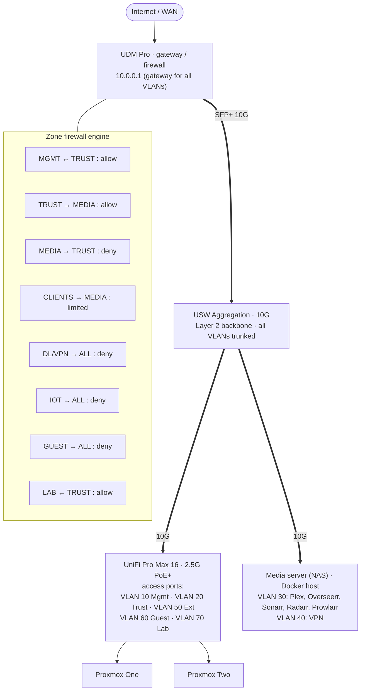

# Network

!!! warning "Unreconciled"
    This diagram and the [VLANs](#vlans) table below disagree. The diagram shows VLANs 10–70
    (Mgmt, Trust, Media, VPN, Ext, Guest, Lab) behind gateway `10.0.0.1`. The table lists only
    Default, IoT and Lab. Neither one has been checked against the live UniFi controller. The
    Kubernetes nodes and LoadBalancer pools are on `192.168.2.0/24` (`kubernetes/clusters/*/cluster.yaml`),
    and neither source shows that subnet.

## Overview

The homelab network is built on Ubiquiti UniFi equipment for reliable, enterprise-grade networking at home.

## Key Components

- **Dream Machine Pro** - Core router and security gateway
- **USW Aggregation** - 10G backbone connectivity
- **UniFi Pro Max 16** - 2.5GbE PoE+ for high-speed device connectivity
- **Aruba 2930f** - Additional PoE+ capacity

## VLANs

| VLAN | Purpose |
|------|---------|
| Default | Management network |
| IoT | Isolated IoT devices |
| Lab | Kubernetes and development |

See [Hardware](hardware.md) for full network equipment details.
