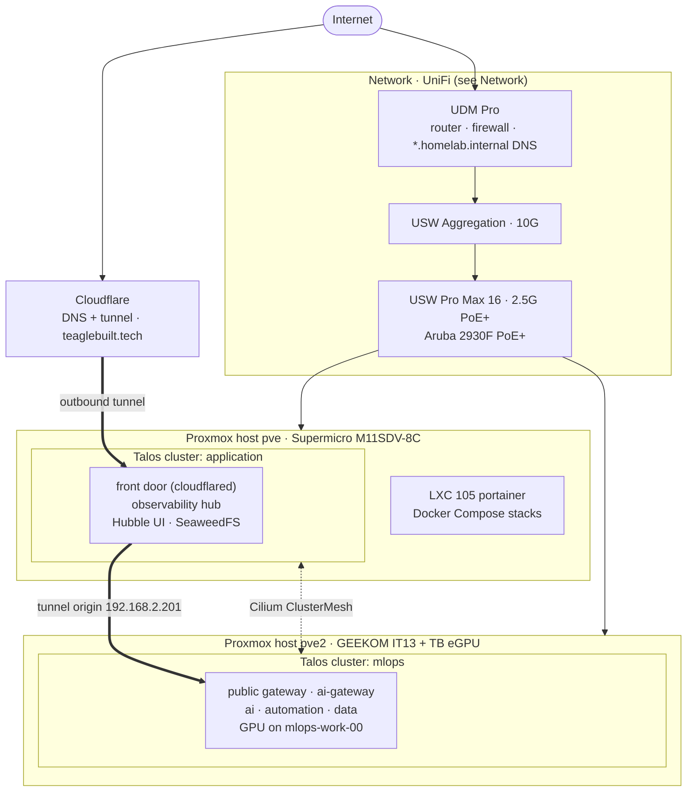

# Overview

The homelab has four layers. UniFi network gear sits at the edge. Two Proxmox hosts run the
compute. On top of them run two Talos Kubernetes clusters joined by Cilium ClusterMesh, plus a
Portainer container for Docker Compose stacks. Everything is declared in this repository.

## High level architecture

* **Public traffic** reaches the homelab only through the Cloudflare tunnel, which runs on
  `application` and forwards to the external gateway on `mlops`. The tunnel is an outbound connection, so it needs no inbound port forward.
  The details are in [Kubernetes → Architecture](kubernetes.md#architecture).
* **LAN traffic** resolves `*.homelab.internal` through UniFi DNS to each cluster's internal gateway.
* **Kubernetes nodes and LoadBalancer IPs** sit on `192.168.2.0/24`. The address pools are in
  `kubernetes/clusters/<cluster>/cluster.yaml`.

## Layers

| Layer | What | Source of truth | Docs |
|-------|------|-----------------|------|
| Hardware | 2 Proxmox hosts, UniFi switching, RTX 4070 Super eGPU | — | [Hardware](hardware.md) |
| Network | UDM Pro, VLANs, zone firewall | UniFi controller (not in repo) | [Network](network.md) |
| VMs | Talos VMs per cluster | `kubernetes/terraform/<cluster>/main.tf`, `tf_modules/talos_cluster` | [Kubernetes](kubernetes.md) |
| Cluster bootstrap | Helmfile stages `00`–`05` | `kubernetes/clusters/`, `kubernetes/helmfile.d/` | [Kubernetes → Bootstrapping](kubernetes.md#bootstrapping) |
| Platform on Kubernetes | ai, automation, data, observability | `platform/<stack>/kubernetes/`, deployed by `task platform:deploy` | [Platform](#platform) |
| Platform on Docker | media, downloads, news, observability (UniFi metrics) | `platform/<stack>/compose.yaml`, pushed as Portainer stacks by `platform/<stack>/terraform/` | [Platform](#platform) |
| Public edge | Cloudflare tunnel routes and DNS | `terraform/cloudflare_tunnel.tf` | [Kubernetes → Gateways](kubernetes.md#gateways) |

## Clusters

| Cluster | Proxmox host | Nodes | Role |
|---------|--------------|-------|------|
| `application` | `pve` | `application-ctrl-00`, `application-work-00` | Front door, observability hub, Hubble UI, SeaweedFS |
| `mlops` | `pve2` | `mlops-ctrl-00`, `mlops-work-00` (GPU), `mlops-work-01` | AI platform, automation, data, public gateway |
| admin | — | — | **Planned.** GitOps (Argo CD) cluster, see `.ai/ROADMAP.md` and [Admin Cluster](kubernetes.md#admin-cluster-planned) |

## Platform

| Stack | Runs on | Deployed by | Docs |
|-------|---------|-------------|------|
| AI (kagent, agentgateway, LLM providers, MCP) | `mlops`, ns `ai` | `task platform:ai:deploy` (`platform/ai/kubernetes/`) | [AI Platform](platform/ai/index.md) |
| Automation (n8n, Firecrawl) | `mlops`, ns `automation` | `task platform:automation:deploy` (`platform/automation/kubernetes/`) | [Automation](platform/workflows.md) |
| Data (CNPG Postgres, Qdrant, Redis) | `mlops`, ns `data` (Qdrant is declared in `data` but currently runs in `default`) | `task platform:data:deploy` (`platform/data/kubernetes/overlays/mlops`) | — |
| Observability (Prometheus, Grafana, Loki, Tempo, OTel) | hub on `application`, agents on `mlops` | `task platform:observability:deploy` + stage `04-monitoring` | [Observability](platform/observability.md) |
| Media (Plex, *arr) | Portainer LXC | `platform/media/terraform/` | [Media](platform/media.md) |
| Downloads (Gluetun, qBittorrent) | Portainer LXC | `platform/downloads/terraform/` | [Media](platform/media.md) |
| News (FreshRSS) | Portainer LXC | `platform/news/terraform/` | — |
| UniFi metrics (Grafana, InfluxDB, UnPoller) | Portainer LXC | `platform/observability/terraform/` | [Observability](platform/observability.md) |
| Research (SearXNG, JupyterHub) | — | Defined in `platform/research/`, but its deploy step is commented out in `platform/Taskfile.yml` | [Research](platform/research.md) |
