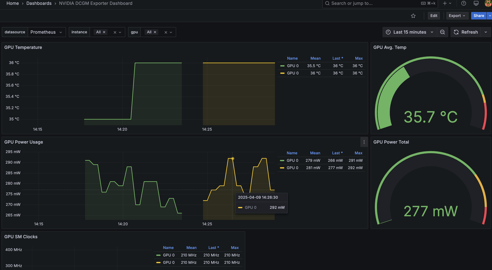

# Observability

## GPU Metrics

## Monitoring Stack

The observability platform includes:

- **Prometheus** - Metrics collection and storage
- **Grafana** - Visualization and dashboards
- **GPU Exporter** - NVIDIA GPU metrics

## Planned Improvements

- Deploy a Prometheus exporter to monitor costs for OpenAI and other AI providers
- Enhanced alerting for resource utilization
- Long-term metrics retention
