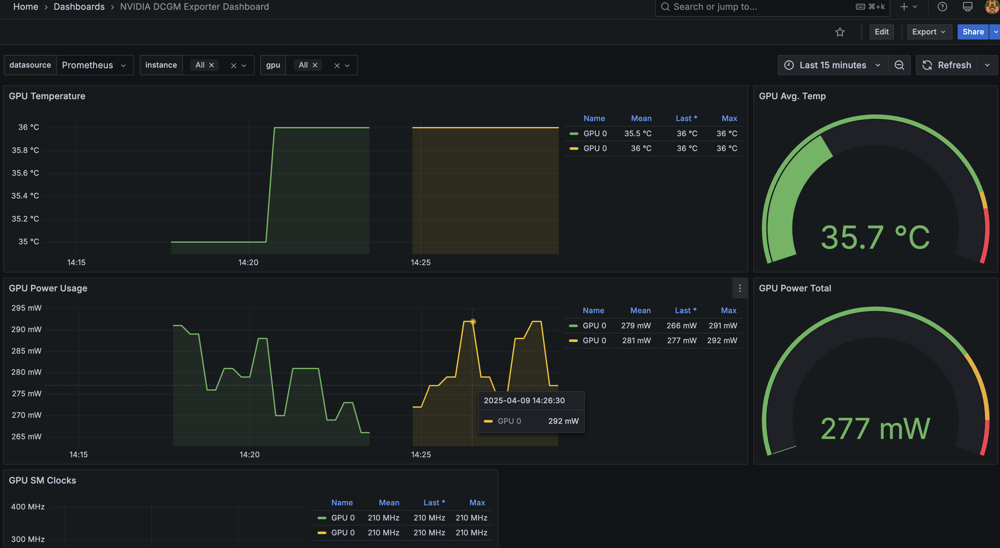

# Observability

Observability uses a hub-and-agent layout. `application` stores and visualises everything. `mlops`
keeps no long-term data and forwards metrics, traces and logs to the hub.

## Where it runs

| Component | Cluster | Namespace | Deployed from |
|-----------|---------|-----------|---------------|
| Prometheus, Alertmanager, Grafana (kube-prometheus-stack) | `application` | `observability` | `platform/observability/kubernetes/apps/prometheus/overlays/application`, `apps/grafana/overlays/application` |
| Loki, Tempo | `application` | `observability` | `platform/observability/kubernetes/apps/loki`, `apps/tempo` |
| OpenTelemetry gateway collector (`otel-collector-mesh`) | `application` | `observability` | `platform/observability/kubernetes/apps/opentelemetry/overlays/application` |
| grafana-operator | `application` | `observability` | Helmfile stage `04-monitoring` (`enable.grafanaOperator`) |
| Prometheus in agent mode (remote-write to `prometheus.homelab.internal`) | `mlops` | `observability` | `platform/observability/kubernetes/apps/prometheus/overlays/mlops` |
| OpenTelemetry agent collector | `mlops` | `observability` | `platform/observability/kubernetes/apps/opentelemetry/overlays/mlops` |
| `loki-gateway-mesh` global Service | `mlops` | `observability` | `platform/observability/kubernetes/apps/loki/mesh-service.yaml` |
| Vector (log shipping to `loki-gateway-mesh`) | both | `observability` | Helmfile stage `04-monitoring` (`kubernetes/apps/monitoring/vector.yaml.gotmpl`) |
| dcgm-exporter (GPU metrics) | `mlops` | `kube-system` | Helmfile stage `03-hardware` (`enable.gpu`) |
| Grafana, InfluxDB, Chronograf, UnPoller (UniFi metrics) | Portainer LXC | — | `platform/observability/compose.yaml`, pushed by `platform/observability/terraform/` |

The Kubernetes stack is applied per cluster by `task platform:observability:deploy CLUSTER=<cluster>`,
which builds `platform/observability/kubernetes/overlays/<cluster>`. Grafana is served on the
`application` internal gateway at `grafana.homelab.internal`.

## GPU Metrics

## Monitoring Stack

The observability platform includes:

- **Prometheus** - Metrics collection and storage
- **Grafana** - Visualization and dashboards
- **Loki / Tempo** - Logs and traces
- **dcgm-exporter** - NVIDIA GPU metrics

## Planned

"Complete Cluster Observability" and "AI Observability" are open items in `.ai/ROADMAP.md`.
