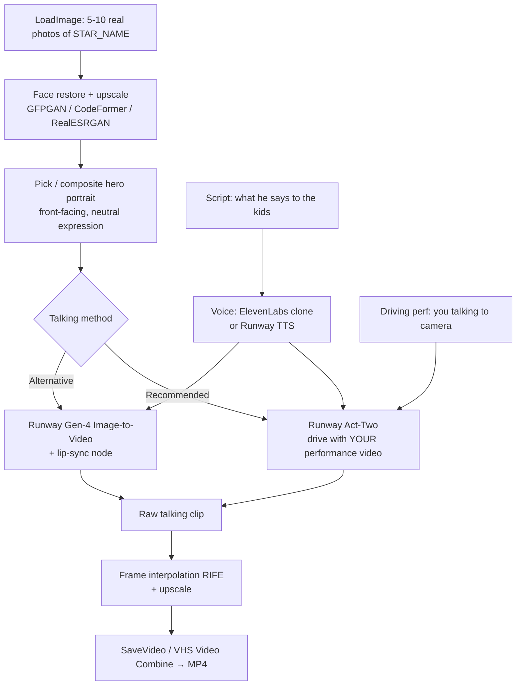

# ComfyUI Workflow — "[STAR_NAME] Talks to the Kids"

> **Placeholder:** Replace every `[STAR_NAME]` with the YouTuber's name once you look it up.
> **Goal:** A short personalized video where a famous YouTube star (looking *exactly* like the real person) talks directly to your kids by name.

---

## 0. Responsible-use note (read once, then move on)

`[STAR_NAME]` is a real, identifiable person. This design is for a **private, one-off family video** — a fun message for your own kids. Keep it that way:

- **Do not** publish, post, or share it publicly, and don't present it as a real endorsement, sponsorship, or genuine recording.
- Don't put words in his mouth that could embarrass him or defame anyone.
- If you ever want to share it beyond the household, get the person's consent first.

Everything below assumes personal/home use.

---

## 1. Why Runway does the likeness (and ComfyUI orchestrates)

Exact likeness of a *specific real human* is the hard part. Text-to-image models (SDXL/FLUX) will give you "a guy who kind of looks like him" — not good enough. The reliable path is:

**Start from real reference photos of `[STAR_NAME]` → let Runway animate/talk from those references.** Runway's Gen-4 reference-guided video and Act-Two performance transfer are built to preserve a specific face across frames, which is exactly what you want.

So the division of labor is:

| Stage | Tool | Job |
|-------|------|-----|
| Reference prep | ComfyUI (local nodes) | Clean, upscale, and pick the best portrait frame of `[STAR_NAME]` |
| Voice / script | ElevenLabs or Runway audio | The words he says to your kids |
| Talking video | **Runway (via ComfyUI API nodes)** | Animate the real face + lip-sync — this is where likeness lives |
| Finish | ComfyUI (local) | Upscale, frame-interpolate, save MP4 |

ComfyUI is the single canvas that wires all of this together via its **built-in API Nodes** (which include Runway), so you don't leave the graph.

---

## 2. Pipeline overview

---

## 3. Assets to prepare before you touch ComfyUI

1. **Reference photos of `[STAR_NAME]`** — 5–10 clear, high-res shots. Front-facing, good even lighting, neutral or slightly smiling, minimal occlusion (no sunglasses/hands over face). This single input is the #1 driver of likeness quality.
2. **The script** — what he says. Personalize it: your kids' names, an inside joke, "great job on [thing]", etc. Keep it 15–45 seconds.
3. **A voice** — pick one:
   - **ElevenLabs voice clone** (best if you have clean audio of `[STAR_NAME]` speaking, and you're comfortable cloning his voice for private use), or
   - **A neutral TTS voice** / your own voice (safer, still fun).
4. **(Recommended path only) A driving performance video** — you, on webcam, saying the exact script with the head movement and expressions you want. Runway Act-Two maps *your* performance onto *his* face.

---

## 4. Workflow — Stage by stage

### Stage 1 — Reference prep (local ComfyUI nodes)

| Node | Purpose | Key settings |
|------|---------|--------------|
| `LoadImage` | Load the best photo of `[STAR_NAME]` | — |
| `ImageUpscaleWithModel` (`RealESRGAN_x4plus`) | Bump resolution/detail | model: RealESRGAN_x4plus.pth |
| Face restore (`FaceRestoreCF` / CodeFormer, from `ComfyUI-ReActor` or `comfyui-facerestore`) | Sharpen the face without changing identity | fidelity/weight ~0.7 (higher = truer to original face) |
| `ImageScale` | Normalize to Runway's expected input (e.g. 1280×720 or square) | — |
| `PreviewImage` | Eyeball the hero frame before spending Runway credits | — |

**Output:** one clean, high-res portrait of `[STAR_NAME]`. Do **not** run it through a heavy txt2img/FLUX pass — that drifts the likeness. Restoration/upscaling only.

### Stage 2 — Talking video (Runway, via ComfyUI API nodes)

Two variants. Pick **A** for the most accurate, controllable talking; use **B** if you can't record a driving performance.

#### Variant A (recommended): Runway Act-Two — performance transfer
- **Character input:** the hero portrait from Stage 1 (his exact face).
- **Driving input:** your webcam clip of you saying the script.
- **Result:** `[STAR_NAME]`'s face, performing *your* expressions, head turns, and lip movements → naturally "talking to the kids."
- In ComfyUI: use the Runway Act-Two API node if your ComfyUI API-nodes version exposes it. Feed `IMAGE` (character) + the driving video + audio.

> Act-Two is ideal because likeness comes from the still image and *motion/lip-sync comes from a real human performance*, which reads far more believable than pure generation.

#### Variant B: Runway Gen-4 Image-to-Video + lip-sync
- **Node:** `Runway Image to Video (Gen4 Turbo)` (ComfyUI built-in API node).
  - `image` = hero portrait
  - `prompt` = e.g. *"friendly man smiling and speaking warmly to the camera, gentle head movement, cheerful, soft indoor lighting"*
  - `duration` = 5–10s per clip, `ratio` = 16:9
- **Then lip-sync** the generated clip to your audio using a local node:
  - `LatentSync`, `SadTalker`, or `Wav2Lip` custom nodes (feed the Gen-4 clip + the voice WAV).
- Chain multiple Gen-4 clips if the message is longer than one generation.

### Stage 3 — Voice (parallel branch)
- If ElevenLabs: generate the WAV outside ComfyUI (or via an HTTP/API custom node) and `LoadAudio` it in.
- If Runway/TTS: produce the WAV, `LoadAudio`.
- This audio feeds the lip-sync (Variant B) or is muxed onto the Act-Two output (Variant A).

### Stage 4 — Finish (local ComfyUI nodes)
| Node | Purpose |
|------|---------|
| `RIFE VFI` (frame interpolation, from `ComfyUI-Frame-Interpolation`) | Smooth 24→48fps, optional |
| `ImageUpscaleWithModel` | Final sharpen if needed |
| `VHS_VideoCombine` (from `ComfyUI-VideoHelperSuite`) or `SaveVideo` | Mux video + audio → final `.mp4` |

---

## 5. Runway setup

1. **API key:** get one from your Runway account (Settings → API). You need API credits — Gen-4 / Act-Two generations are billed per second of output.
2. **ComfyUI API nodes:** update ComfyUI to a recent version so the built-in Runway API nodes appear (they live under the *api node* category). Log in / paste your Runway key in the ComfyUI API-nodes credential settings.
3. **Cost sanity check:** start with a single 5-second clip to validate likeness before generating the full message. Reference-guided runs are cheap to iterate on if you keep clips short.

---

## 6. Parameter recommendations

- **Reference image:** highest resolution you can find; face fills ~40–60% of frame; neutral background helps the model isolate him.
- **Clip length:** 5–10s per Runway generation. Stitch in Stage 4 for a longer message.
- **Aspect ratio:** 16:9 for TV/laptop viewing; 9:16 if it's for a phone.
- **Face-restore fidelity:** lean *high* (truer to the real face) over *creative* — you want identity, not beautification.
- **Prompt tone (Variant B):** describe demeanor and motion ("warm, smiling, talking to a child"), **not** a new appearance — let the reference own the looks.

---

## 7. Custom nodes / models to install

**Custom nodes (ComfyUI-Manager):**
- `ComfyUI-VideoHelperSuite` — `VHS_VideoCombine`, load/save video
- `ComfyUI-Frame-Interpolation` — RIFE
- One lip-sync pack (Variant B): `ComfyUI-LatentSync` **or** `ComfyUI-SadTalker` **or** a Wav2Lip node
- A face-restore pack: `ComfyUI-ReActor` or `comfyui-facerestore-cf`
- (Built-in) ComfyUI **API Nodes** — provides the Runway nodes; no separate install, just update ComfyUI.

**Local models:**
| Model | Directory | Source |
|-------|-----------|--------|
| `RealESRGAN_x4plus.pth` | `models/upscale_models/` | https://huggingface.co/ai-forever/Real-ESRGAN |
| `codeformer.pth` (or GFPGAN) | `models/facerestore_models/` | https://huggingface.co/sczhou/CodeFormer |
| RIFE weights | auto-downloaded by the node | — |

> Runway itself runs in the cloud — no local Runway weights to download. The only local models are the prep/finish helpers above.

---

## 8. Run order (checklist)

1. [ ] Look up `[STAR_NAME]`, gather 5–10 reference photos.
2. [ ] Write the script (include kids' names).
3. [ ] Produce the voice WAV (ElevenLabs / TTS / your voice).
4. [ ] (Variant A) Record your driving performance clip.
5. [ ] ComfyUI Stage 1: restore + upscale → hero portrait, preview it.
6. [ ] ComfyUI Stage 2: Runway Act-Two (A) **or** Gen-4 + lip-sync (B) — generate ONE 5s test clip.
7. [ ] Verify likeness on the test clip. Adjust reference photo / fidelity if off.
8. [ ] Generate the full message (stitch clips if needed).
9. [ ] Stage 4: interpolate/upscale, mux audio → final MP4.
10. [ ] Watch it once yourself before showing the kids. 🎬

---

## 9. Likeness troubleshooting

| Problem | Fix |
|---------|-----|
| Face looks "off" / generic | Use a sharper, more front-facing reference; raise face-restore fidelity; avoid any txt2img pass on his face. |
| Identity drifts over the clip | Keep clips short (≤5–8s); prefer Act-Two (motion from real performance) over pure Gen-4. |
| Lips don't match audio (Variant B) | Try a different lip-sync node (LatentSync usually beats Wav2Lip on quality); ensure audio is clean mono WAV. |
| Stiff / robotic motion | Give Act-Two a livelier driving performance, or add motion cues in the Gen-4 prompt. |

---

*Next step for you: fill in `[STAR_NAME]`, drop in the reference photos, and I can generate the actual ComfyUI workflow `.json` (with the Runway API nodes wired up) whenever you're ready.*
