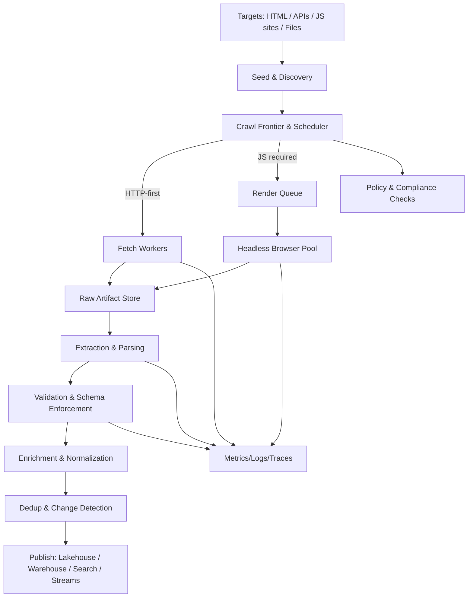

# Architecture

## Data Platform Architecture

## Data Collection Architecture



```mermaid
graph LR
  subgraph CP[Control Plane]
    CP1[Tenant Mgmt & RBAC]
    CP2[Job Registry & Config]
    CP3[Scheduling/Orchestration]
    CP4[Policy Engine]
    CP5[Secrets & Key Mgmt]
    CP6[Audit & Cost Attribution]
  end

  subgraph DP[Data Plane]
    DP1[Frontier Shards]
    DP2[HTTP Fetcher Pool]
    DP3[Browser Pool]
    DP4[Proxy/Egress Gateway]
    DP5[Parser/Extractor Workers]
  end

  subgraph DATA[Central Data Platform]
    S1[Object Store: Raw + Curated]
    S2[Table Format: Iceberg/Delta/Hudi]
    S3[Stream/Queue: Kafka/Pulsar]
    S4[Search/Index: OpenSearch]
    S5[Metadata & Lineage]
  end

  subgraph OBS[Observability]
    O1[OpenTelemetry]
    O2[Prometheus]
    O3[Dashboards/Alerting]
  end

  CP1 --> CP2 --> CP3 --> DP1
  CP4 --> DP1
  CP5 --> DP2
  CP5 --> DP3
  DP4 --> DP2
  DP4 --> DP3
  DP1 --> DP2 --> S1
  DP3 --> S1
  S1 --> DP5 --> S2
  DP5 --> S3
  S2 --> S4
  DP2 --> O1
  DP3 --> O1
  O1 --> O2 --> O3
  CP6 --> O3
  S5 --> O3
  ```
